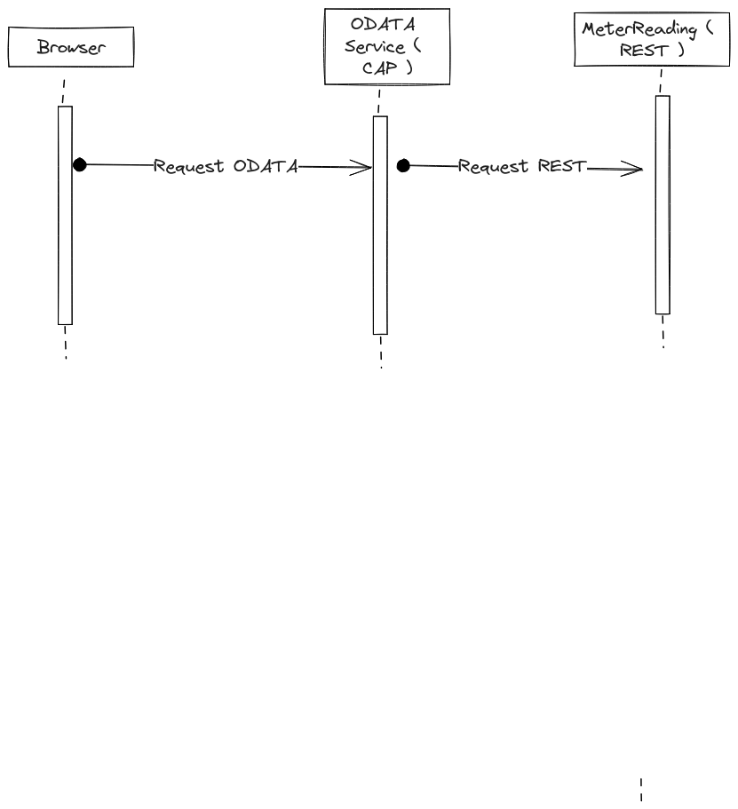

# CAP Services to translate a REST Quarkus into a ODATA deployed KYMA
l
This tutorial describes, how to translate the REST Service of the Quarkus application ( see previous blog [A Quarkus REST Service] (https://community.sap.com/t5/open-source-blogs/sending-and-receiving-kafka-messages-using-quarkus-and-kyma/ba-p/13583287 ) into a ODATA Service. )

We are using a CAP Service and an SQLITE Database to store the result of the REST Call. The ODATA service is exposed automatically from the cds schema/service.

See the project on Github [rest2odata_cap_kyma](https://github.com/mizmauz/rest2odata_cap_kyma)



The project has two subfolders:
- rest2odata 
    SAP CAP stateless service which calls the REST and transforms to ODATA (V4)
- odatafiori 
    Another CAP service with a database that joins its local table with the table on the odata service (rest2odata) and displays the complete data set. 

In the end, there will be three separate PODs on KYMA ( including the Quarkus Kafka REST ) which depend on each other.

## Getting Started

Setting up your local development environment: https://developers.sap.com/group.scp-local-tools.html


File or Folder | Purpose
---------|----------
`app/` | content for UI frontends goes here
`db/` | your domain models and data go here
`srv/` | your service models and code go here
`package.json` | project metadata and configuration
`readme.md` | this getting started guide

``` commands
npm install
```

Use Visual Studio Code with sap cds/sap fiori extensions

See: https://developers.sap.com/tutorials/fiori-tools-vscode-setup.html


## rest2odata - the proxy

- [package.json ](./rest2odata/package.json)
    Dependencies (sqlite) and the path to the REST application (Quarkus)

- [/db/schema.cds](./rest2odata/db/schema.cds), *Schema for MeterReading*

    The *MeterReading* object in schema.cds is defined to map the fields of the REST call to the CDS Datatypes

    ``` schema.cds
    namespace heureso.db;

    entity MeterReading {
    key id : Int64;
    meternumber : String(30);
    reading_date : Date;
    reading_time: Time;
    readingsource: String(10);
    readingreason: String(10);
    unitofreading: String(3);
    readingamount: Double;
    readingamount_estimated: Double;
    calc_consumption: Double;
    calc_days: Int32;
    weight: Double;
    readingstatus: String(10);
    errorcode: String(10);
    }
    ```

- [/srv/service.js](./rest2odata/srv/service.js), corresponds to service.cds

    The *before* method in service.js first reads the response from the REST and stores the result in the SQLITE Database.
    The fields of REST are mapped to the schema.cds fields 

    ``` service.js
    this.before('READ', MeterReading, async (req)
    ```

- [/srv/service.cds](./rest2odata/srv/service.cds) service definition

    The service definition for the ODATA (service.cds) is projected to the *MeterReading* Object, which was filled with the REST response. 

    ``` service.cds
    entity MeterReading as projection on db.MeterReading;
    ```

- [buildAndDeploy_kyma.sh ](./rest2odata/buildAndDeploy_kyma.sh) Deployment script for DOCKER and K8S
    Script to build the Docker Image, push the image. Afterwards the deployment to KYMA cluster is triggered.

### Start and test the service
Start the Quarkus Service beforehand
Open a new terminal window: start the service and check the odata:

``` cds
cds watch --port 9004
```

Check the OData Metadata: 
http://localhost:9004/odata/v4/MeterReading/$metadata

Check the actual payload
http://localhost:9004/odata/v4/MeterReading/MeterReading

See the curl file [curl](./rest2odata/http/curls.http)


### Generating the .edxm File ( Entity Data Model File )
Automated generation of a Service based on the .edmx file. This will be used for the second service to be generated based on restodata service.

``` cds
cds compile srv -s heureso.srv.MeterReadingService -2 edmx > MeterReadingService.edmx && mv MeterReadingService.edmx .. && cd ..
```

### Understanding ODATA
For basic unterstanding of ODATA see here a good explanation (OData Description)[https://cap.cloud.sap/docs/advanced/odata]
In essence, all the tags in the service description are translated into the ODATA using annotations of ODATA itself or SAP specific annotations, which are used for the user interface, searching etc.

## odatafiori ( ODATA Client with Fiori)
The odatafiori is a another cup service, which holds the second part of the data model ( MeterReadingDevice). This 


 - [/db/schema.cds](./odatafiori/db/schema.cds), *MeterReadingDevice*
    An association with the MeterReading object from the REST Service

- [/srv/service.cds](./odatafiori/srv/service.cds) Definition of Service
    Definition of the ODATA Service for MeterReadingDevice
    Fiori annotations for MeterReadingDevice and MeterReading

    See this page for details on the fiorio annotations: https://cap.cloud.sap/docs/advanced/odata#example

- [package.json](./odatafiori/package.json) Holds the path to the other odata service
    Destination for MeterReading

    ``` package.json
    "requires": {
      "MeterReadingService": {
        "kind": "odata",
        "model": "srv/external/MeterReadingService",
        "credentials" : {
          "url": "http://localhost:9004/odata/v4/MeterReading"
         
        }
        
      },
    ```

### Test the service
1. Start the Quarkus Service beforehand

2. Open a new terminal window: start the rest2odata service and check the odata:

``` cds
cds watch --port 9004
```

3. Open a new terminal window: start the odatafiori service and check the odate

``` cds
cds watch --port 9005
```

4. Test http
See tests in curl [curl.http](./odatafiori/http/curls.http)


Check the OData Metadata: 
http://localhost:9005/odata/v4/event/$metadata

Check the actual payload
http://localhost:9005/odata/v4/event/MeterReadingDevice

Test the connection to the first service.

http://localhost:9005/odata/v4/event/MeterReading?$select=id
http://localhost:9005/odata/v4/event/MeterReading?$select=id
http://localhost:9005/odata/v4/event/MeterReading(id=2)
http://localhost:9005/odata/v4/event/MeterReading(id=2)/name

http://localhost:9005/odata/v4/event/MeterReadingDevice?$select=meterreading


### Use ODATA V2 ( for UI5 Application Generator)
Some of the automatic UI5 generators still use OdataV2, this add on enables V2. As a result V2 and V4 are available at the same time.

See https://cap.cloud.sap/docs/advanced/odata#v2-support


## Test the Dockerfile [Dockerfile](./odatafiori/docker/Dockerfile)
The dockfile includes a curl to test the connection within the Pod when deployed on KYMA.

``` Docker
docker build -f ./docker/Dockerfile -t odatatest .
docker run odatatest
```

## deploy the service to KYMA
[./buildAndDeploy_kyma.sh](./odatafiori/buildAndDeploy_kyma.sh) ( uses /docker/Dockerfile and /k8s/odatafiori.ymal files)

## Sources:
- The logic is based on this very good tutorial: Translate REST to ODATA using CAP
[Rest2Odata using cap](https://blogs.sap.com/2023/06/07/convert-rest-to-odata-through-a-proxy-service-using-cap/)


